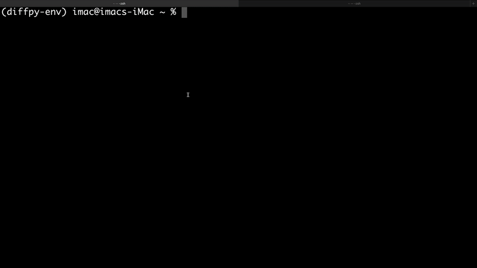

|Icon|
===============

.. |title| replace:: scikit-package
.. _title: https://scikit-package.github.io/scikit-package

.. |Icon| image:: img/logos/scikit-package-logo-text.png
        :target: https://scikit-package.github.io/scikit-package
        :height: 150px

|PyPI| |Forge| |PythonVersion| |PR|

|CI| |Codecov| |Black| |Tracking|

.. |Black| image:: https://img.shields.io/badge/code_style-black-black
        :target: https://github.com/psf/black

.. |CI| image:: https://github.com/scikit-package/scikit-package/actions/workflows/matrix-and-codecov-on-merge-to-main.yml/badge.svg
        :target: https://github.com/scikit-package/scikit-package/actions/workflows/matrix-and-codecov-on-merge-to-main.yml

.. |Codecov| image:: https://codecov.io/gh/scikit-package/scikit-package/branch/main/graph/badge.svg
        :target: https://codecov.io/gh/scikit-package/scikit-package

.. |Forge| image:: https://img.shields.io/conda/vn/conda-forge/scikit-package
        :target: https://anaconda.org/conda-forge/scikit-package

.. |PR| image:: https://img.shields.io/badge/PR-Welcome-29ab47ff
        :target: https://github.com/scikit-package/scikit-package/pulls

.. |PyPI| image:: https://img.shields.io/pypi/v/scikit-package
        :target: https://pypi.org/project/scikit-package/

.. |PythonVersion| image:: https://img.shields.io/pypi/pyversions/scikit-package
        :target: https://pypi.org/project/scikit-package/

.. |Tracking| image:: https://img.shields.io/badge/issue_tracking-github-blue
        :target: https://github.com/scikit-package/scikit-package/issues

``scikit-package`` offers tools and practices for the scientific community to make better and more reusable Scientific Python packages and applications:

- We help scientists share scientific code to amplify research impact.

- We help scientists save time, allowing them to focus on writing scientific code.

- We offer best practices from the group's experience in developing scientific software.

Overview
--------

Here is an overview of the 5 levels of sharing code and the key features of ``scikit-package``:

.. image:: img/figures/scikit-package-overview-qr-code.png
    :alt: Diagram of 5 levels of sharing code with key features and scikit-package commands
    :width: 800px
    :align: center

Demo
----

Here is how you can use the ``package create public`` command to create a new Level 5 Python package called ``diffpy.my-project`` in just 1–2 minutes:

Getting started
---------------

Are you interested in using ``scikit-package``? Begin with the ``Getting Started`` page in our online documentation at https://scikit-package.github.io/scikit-package!

How to cite ``scikit-package``
------------------------------

If you use ``scikit-package`` to standardize your Python software, we would like you to cite scikit-package:

  S. Lee and C. Myers and A. Yang and T. Zhang and S. J. L. Billinge, scikit-package - software packaging standards and roadmap for sharing reproducible scientific software (https://arxiv.org/abs/2507.03328)

Acknowledgements
----------------

This GitHub repository is built and maintained with the help of `scikit-package <https://scikit-package.github.io/scikit-package/>`_ as well.
