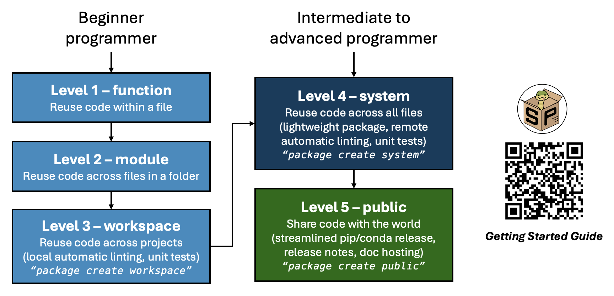

#######

.. |title| replace:: scikit-package documentation

| Software version |release|.
| Last updated |today|.

Welcome to Billinge Group's Python ``scikit-package`` documentation!

``scikit-package`` offers tools and practices for the scientific community to make better and more reusable Scientific Python packages and applications.

How does ``scikit-package`` benefit scientists?
-----------------------------------------------

``scikit-package`` offers step-by-step instructions for reusing and sharing code, starting from something as simple as defining and using functions, all the way to maintaining and releasing a fully documented open-source package on PyPI and conda-forge.

Here are the 3 goals of ``scikit-package`` for the scientific community:

#. We help scientists share scientific code to **amplify research impact**.

#. We help scientists save time, allowing them to **focus on writing scientific code**.

#. We offer **best practices** from the group's experience in developing scientific software.

Here is an overview of the five levels of reusing and sharing code and the key features of ``scikit-package``:

The steps are divided into five levels of shareability and complexity, allowing users to choose the level that best suits their current needs. Code can be moved to higher levels as necessary.

- Level 1, ``function``, which is already widely used, consists of simply defining functions within the same file or module.

- Level 2, ``module``, expands on Level 1 by reusing functions across separate module files within the same directory.

- Level 3, ``workspace``, restructures the organization so that a block of code can be reused across multiple projects.

- Level 4, ``system``, enables users to create a lightweight package so that the code can be reused across all files locally.

- Level 5, ``public``, is the final step, where the source code is uploaded online so that anyone in the world can install the package, sourced from PyPI or conda-forge.

Who is using ``scikit-package``?
----------------------------------

The full list of packages is as follows:

- `diffpy.pdffit2 <https://github.com/diffpy/diffpy.pdffit2>`_
- `diffpy.fourigui <https://github.com/diffpy/diffpy.fourigui>`_
- `diffpy.pdfgui <https://github.com/diffpy/diffpy.pdfgui>`_
- `diffpy.utils <https://github.com/diffpy/diffpy.utils>`_
- `diffpy.structure <https://github.com/diffpy/diffpy.structure>`_
- `diffpy.labpdfproc <https://github.com/diffpy/diffpy.labpdfproc>`_
- `diffpy.pdfmorph <https://github.com/diffpy/diffpy.pdfmorph>`_
- `diffpy.snmf <https://github.com/diffpy/diffpy.snmf>`_
- `diffpy.srmise <https://github.com/diffpy/diffpy.srmise>`_
- `regolith <https://github.com/regro/regolith>`_
- `bg-mpl-stylesheets <https://github.com/Billingegroup/bg-mpl-stylesheets>`_
- ...

How do I get started?
---------------------

Please visit the :ref:`Getting started <getting-started>` page to learn how to navigate the documentation!

What are the full benefits when I reach Level 5?
-------------------------------------------------

- Set up local and remote ``pre-commit`` hooks to automate linting of code for `PEP8 <https://peps.python.org/pep-0008/>`_, `PEP256 <https://peps.python.org/pep-0256/>`_, static files such as ``.json``, ``.yml``, and ``.md``, as well as spelling checks.
- Use GitHub ``tags`` to trigger PyPI/GitHub releases, documentation hosting, and CHANGELOG updates with a single command.
- Generate ``Codecov`` reports for each GitHub pull request (PR).
- Start with a comprehensive ``README.rst`` template containing badges, installation instructions, support, and contribution guides for your GitHub repository.
- Host documentation with a public URL using a rich ``Sphinx`` documentation template with live rendering, including API documentation and examples on how to use the documentation.
- Ensure compatibility with the latest Python versions, adhering to `SPEC0 <https://scientific-python.org/specs/spec-0000/>`_.
- Verify whether a news file is included for each PR, which will later be used to generate the CHANGELOG during the release process.

For technical users, here are some of the advanced features:

- Namespace package support, e.g., ``import diffpy.utils``.
- Generate conda-package ``meta.yaml`` with ``package create conda-forge``.
- Support headless GitHub CI testing for GUI applications.
- Support non-pure Python package releases with ``cibuildwheel``.
- Reusable GitHub Actions workflows located in `Billingegroup/release-scripts <https://github.com/Billingegroup/release-scripts/tree/main/.github/workflows>`_.

How do I receive support?
-------------------------

If you have any questions or have trouble, please read the :ref:`Frequently asked questions (FAQ) <frequently-asked-questions>` section to see if your questions have already been answered. If there aren't answers available, please create `GitHub Issues <https://github.com/Billingegroup/scikit-package/issues>`_.

How can I contribute to ``scikit-package``?
-------------------------------------------

Do you have any new features? Please make an issue via the GitHub issue tracker for further discussions. For a minor typo or grammatically incorrect sentence, please make a pull request. Before making a PR, please run ``pre-commit run --all-files`` to ensure the code is formatted.

=======
Authors
=======

- Sangjoon Lee (sl5400@columbia.edu)
- Andrew Yang (ay2546@columbia.edu)
- Simon Billinge (sb2896@columbia.edu)

scikit-package is developed by Billinge Group and its community contributors.

For a detailed list of contributors, see
https://github.com/Billingegroup/scikit-package/graphs/contributors.

================
Acknowledgements
================

The Billinge Group's scikit-package has been modified from the NSLS-II scientific cookiecutter: https://github.com/nsls-ii/scientific-python-cookiecutter

=================
Table of contents
=================
.. toctree::
   :maxdepth: 2

   getting-started
   tutorials-beginner
   tutorials-intermediate-advanced
   examples
   pypi-release-guide
   conda-forge-release-guide
   migration-guide
   billinge-group-standards
   frequently-asked-questions
   license
   release

=======
Indices
=======

* :ref:`genindex`
* :ref:`search`
